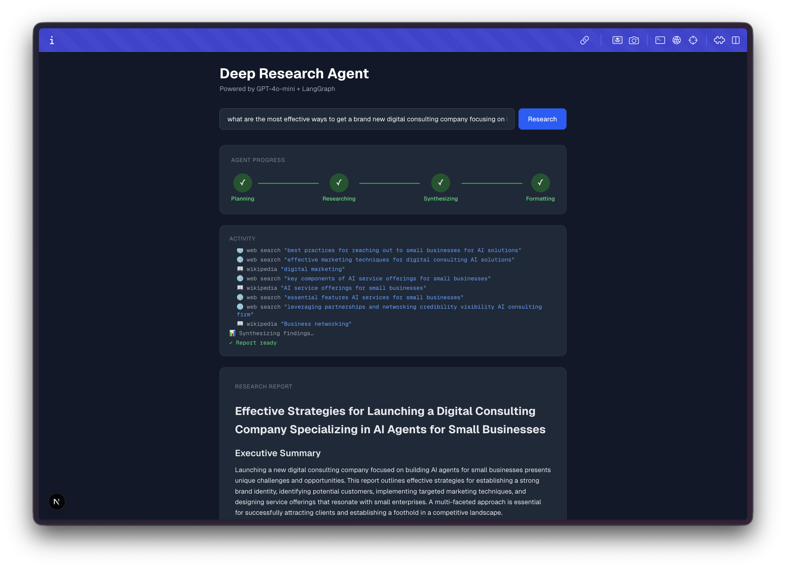
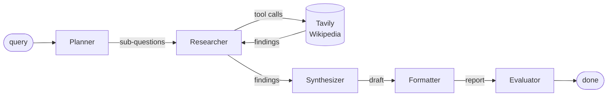

# Deep Research Agent

A full-stack AI research tool that accepts a natural-language query, runs it through a multi-node LangGraph pipeline, and streams real-time agent progress to the browser via SSE, ending with a rendered markdown report and an automated quality evaluation.



---

## What It Does

1. User types a research query
2. **Planner** (LLM) decomposes it into 3–5 sub-questions
3. **Researcher** runs a tool-calling loop per sub-question — the LLM autonomously decides when to call Tavily web search or Wikipedia, and when it has enough information to stop
4. **Synthesizer** (LLM) merges all findings into a coherent draft
5. **Formatter** (LLM) structures the draft into a clean markdown report
6. **Evaluator** (LLM) scores the report on relevance, completeness, and confidence (0–10)

Every node emits SSE events — the browser updates in real time as the agent works.

---

## Tech Stack

| Layer | Technology |
|---|---|
| Frontend | Next.js 16, TypeScript, Tailwind CSS |
| Backend | Python 3.13, FastAPI |
| Agent | LangGraph |
| LLM | OpenAI (GPT-4o-mini by default; configurable) |
| Search | Tavily API, Wikipedia |
| Streaming | Server-Sent Events (SSE) |

---

## Architecture

```
Browser → Next.js API route → FastAPI → LangGraph graph
                ↑                            |
                └──────── SSE stream ────────┘
```

The Next.js API route acts as a **proxy**: it forwards the query server-side to FastAPI and re-streams the SSE response to the browser. The backend URL never reaches the client.

### LangGraph Pipeline



Each node is a pure function `(AgentState) -> AgentState`. LangGraph manages state transitions; `astream_events()` exposes node lifecycle and tool call events which `main.py` maps to typed SSE events.

---

## Setup

```bash
# Backend
cd backend
uv run fastapi dev main.py

# Frontend (separate terminal)
cd frontend
pnpm dev
```

Environment variables:

```bash
# backend/.env
OPENAI_API_KEY=sk-...
TAVILY_API_KEY=tvly-...
# MODEL=gpt-4o   # optional — defaults to gpt-4o-mini
```

```bash
# frontend/.env.local
BACKEND_URL=http://localhost:8000
```

---

## Key Design Decisions

### Why LangGraph over a simple LLM chain?

A linear chain (`prompt → LLM → output`) works for single-step tasks. Research requires multiple distinct stages with different responsibilities and different failure modes. LangGraph gives us:

- **Explicit state**: `AgentState` is a typed dict passed between nodes — easy to inspect, test, and extend
- **Conditional edges**: easy to add retry logic (e.g. re-research if evaluator score is too low) or parallel branches (e.g. spawn one researcher per sub-question)
- **Observability**: `astream_events()` exposes every node start/end and every tool call with zero instrumentation code in the nodes themselves

A simple chain would require monkey-patching or custom callbacks to get equivalent visibility.

### Why SSE over WebSockets?

SSE is unidirectional (server → client), which matches the use case exactly — the client sends one request and receives a stream of updates. Compared to WebSockets:

- **Simpler**: standard `fetch` + `ReadableStream` on the client, `StreamingResponse` on FastAPI — no connection upgrade, no socket management
- **HTTP semantics**: works with standard proxies, load balancers, and CDNs without special configuration
- **Auto-reconnect**: built into the SSE spec (the browser handles it)

WebSockets would be appropriate if the client needed to send messages mid-stream (e.g. user follow-up questions or steering the agent). That's a natural next step.

### Why the Next.js API route proxy?

Two reasons:
1. **Security**: the FastAPI URL stays server-side — it can be a private VPC address in production
2. **Flexibility**: auth headers, rate limiting, or request transformation can be added in one place without touching the Python backend

### How would you scale this?

The current architecture uses a long-lived HTTP connection per request. For production:

- **Replace SSE with a job queue** (Redis + Celery or SQS + Lambda): client submits a job, polls or subscribes for updates. Decouples the HTTP layer from agent execution time.
- **Parallelize the researcher**: instead of running sub-questions sequentially, use LangGraph's `Send` API to spawn parallel researcher sub-graphs — one per sub-question. This would cut research time by ~4x.
- **Cache with a RAG layer**: embed completed reports in a vector store (ChromaDB / Pinecone). On new queries, check for a semantic cache hit before running the full pipeline.
- **Add a supervisor node**: if the evaluator scores below a threshold, route back to the researcher for a second pass — a simple conditional edge in LangGraph.

---

## Project Structure

```
deep-research-agent/
├── backend/
│   ├── main.py                    # FastAPI app, SSE endpoint, astream_events mapping
│   ├── settings.py                # pydantic-settings config
│   ├── agent/
│   │   ├── state.py               # AgentState TypedDict
│   │   ├── graph.py               # LangGraph graph definition
│   │   ├── nodes/
│   │   │   ├── planner.py         # Decomposes query → sub-questions (structured output)
│   │   │   ├── researcher.py      # Tool-calling loop per sub-question (ReAct)
│   │   │   ├── synthesizer.py     # Merges findings → draft
│   │   │   ├── formatter.py       # Draft → structured markdown
│   │   │   └── evaluator.py       # Scores report (relevance, completeness, confidence)
│   │   └── tools/
│   │       ├── web_search.py      # Tavily search tool
│   │       └── wikipedia.py       # Wikipedia lookup tool
│   └── pyproject.toml
└── frontend/
    ├── app/
    │   ├── page.tsx               # Main page (SSE consumer, state management)
    │   ├── api/research/route.ts  # Proxy route → FastAPI
    │   └── components/
    │       ├── QueryInput.tsx
    │       ├── AgentProgress.tsx  # 4-step progress tracker
    │       ├── ActivityLog.tsx    # Real-time tool call feed
    │       └── ReportViewer.tsx   # Markdown renderer + quality scores
    └── lib/
        ├── types.ts               # Zod-validated SSE event schemas
        └── stream.ts              # Async generator SSE reader
```
