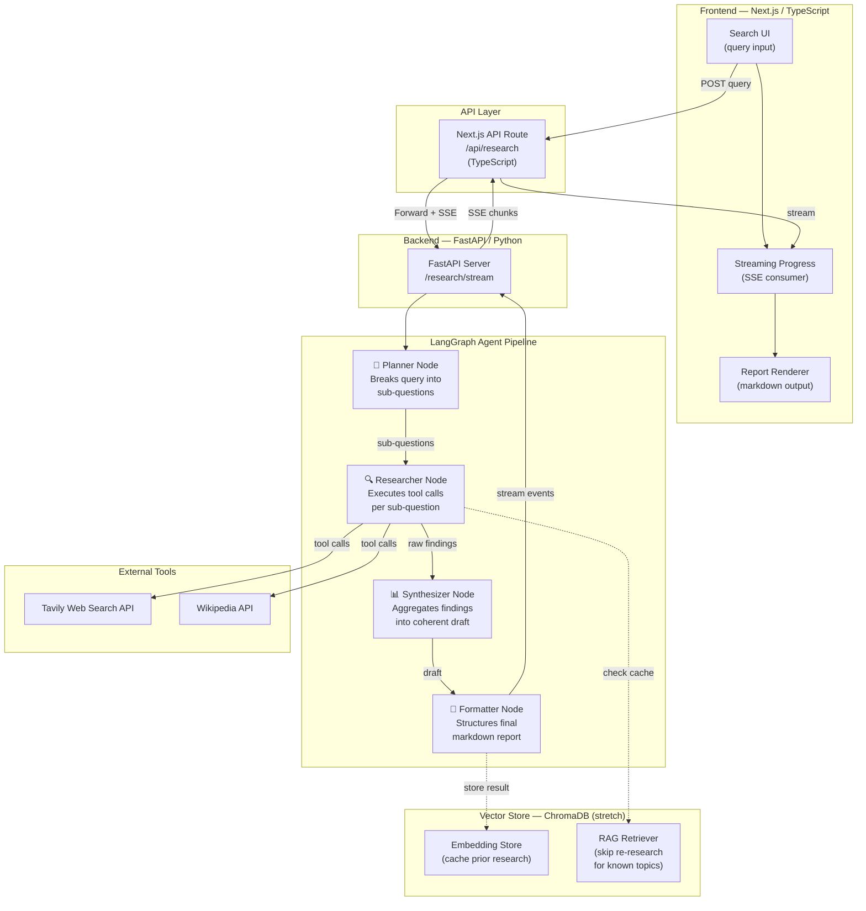
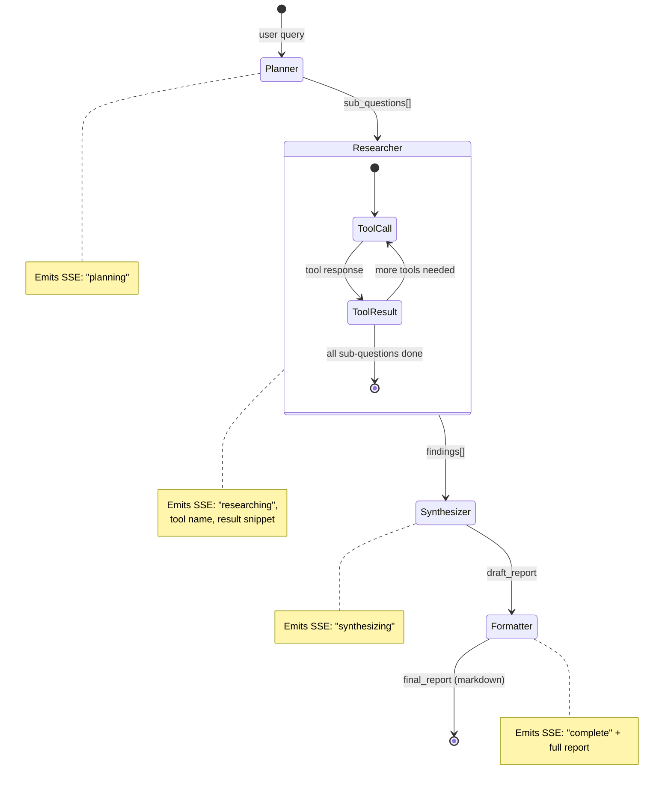
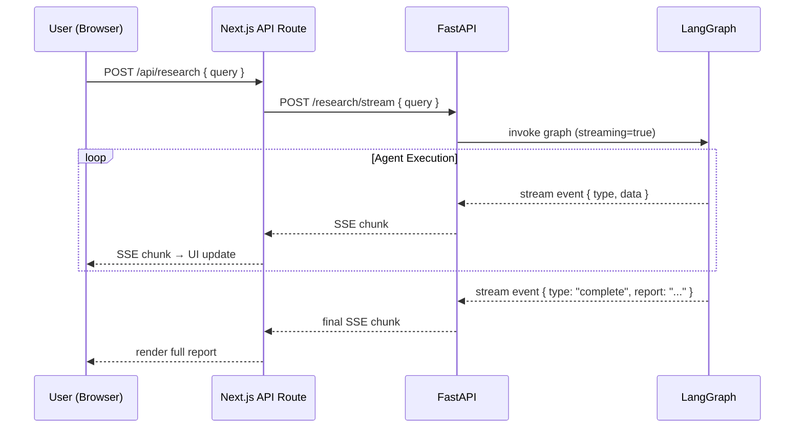

# Deep Research Agent — Project Plan

A full-stack AI research tool.

---

## What It Does

The user types a research query (e.g. *"What are the most effective digital marketing strategies for live events in 2025?"*). A multi-node LangGraph pipeline runs on the Python backend, breaking the query into sub-questions, researching each one via tool calls, synthesizing the findings, and formatting a structured report. The Next.js frontend streams the agent's internal progress in real time — users watch each node fire, see tool calls resolving, and receive a final rendered report.

---

## Tech Stack

| Layer | Technology | Why |
|---|---|---|
| Frontend | Next.js 14+ (App Router), TypeScript | Full-stack TS, App Router patterns, streaming UI |
| Styling | Tailwind CSS | Fast, clean UI |
| Backend | Python 3.11+, FastAPI | Async, production-grade Python |
| Agent Framework | LangGraph | State machine control, observable, extensible |
| LLM | Anthropic Claude API (or OpenAI) | Tool use, structured output |
| Streaming | Server-Sent Events (SSE) | Real-time agent progress to frontend |
| Vector Store *(stretch)* | ChromaDB | RAG pipeline, caching prior research |
| Package Management | uv (Python), pnpm (Node) | Modern, fast tooling |

---

## System Architecture



---

## LangGraph Agent — Node Detail



---

## Data Flow — Streaming



---

## Directory Structure

```
deep-research-agent/
├── frontend/                        # Next.js TypeScript app
│   ├── app/
│   │   ├── page.tsx                 # Main search UI
│   │   ├── api/
│   │   │   └── research/
│   │   │       └── route.ts         # API route → forwards to FastAPI + streams back
│   │   └── components/
│   │       ├── QueryInput.tsx       # Search form
│   │       ├── AgentProgress.tsx    # Real-time node status display
│   │       └── ReportViewer.tsx     # Markdown report renderer
│   ├── lib/
│   │   ├── types.ts                 # Shared TypeScript types (SSE event shapes)
│   │   └── stream.ts               # SSE reading utility
│   └── package.json
│
├── backend/                         # Python FastAPI + LangGraph
│   ├── main.py                      # FastAPI app, /research/stream endpoint
│   ├── agent/
│   │   ├── graph.py                 # LangGraph graph definition (nodes + edges)
│   │   ├── nodes/
│   │   │   ├── planner.py           # Planner node
│   │   │   ├── researcher.py        # Researcher node (tool calls)
│   │   │   ├── synthesizer.py       # Synthesizer node
│   │   │   └── formatter.py        # Formatter node
│   │   ├── tools/
│   │   │   ├── web_search.py        # Tavily search tool
│   │   │   └── wikipedia.py         # Wikipedia lookup tool
│   │   └── state.py                 # LangGraph state schema (TypedDict)
│   ├── vector_store/                # Stretch: RAG layer
│   │   ├── embedder.py
│   │   └── retriever.py
│   └── pyproject.toml
│
└── README.md
```

---

## Build Plan (3–5 Days)

### Day 1 — Skeleton End-to-End ✦ *Most important day*

The goal is a working pipeline with fake/stub data — no polish, just proof that all the pieces connect.

- [ ] Scaffold Next.js app with TypeScript and Tailwind
- [ ] Scaffold FastAPI backend with a `/research/stream` endpoint that returns mock SSE events
- [ ] Wire up Next.js API route to consume and re-stream SSE from FastAPI
- [ ] Build a minimal `AgentProgress` component that reads the SSE stream and logs events to screen
- [ ] Define `AgentState` TypedDict in Python and create a 2-node LangGraph graph (planner → formatter, no tools yet)
- [ ] Verify events flow from LangGraph → FastAPI → Next.js → browser

**Done = you can type a query and see fake agent steps appear in the browser in real time**

---

### Day 2 — Real Agent Logic

- [ ] Implement `Planner` node: calls LLM with system prompt to decompose query into 3–5 sub-questions, returns structured output
- [ ] Implement `Researcher` node: for each sub-question, bind tools (Tavily + Wikipedia) and run tool-calling loop
- [ ] Implement `Synthesizer` node: feeds all raw findings into LLM, produces a coherent draft
- [ ] Implement `Formatter` node: converts draft into clean markdown with headings, sources, summary
- [ ] Each node emits a typed SSE event so the frontend can display which step is running

**Done = real research results flowing through the graph**

---

### Day 3 — Frontend Polish

- [ ] Design `QueryInput` component with loading state and input validation (TypeScript)
- [ ] Build `AgentProgress` as a proper step-tracker (Planner → Researcher → Synthesizer → Formatter with status indicators)
- [ ] Build `ReportViewer` to render the final markdown report beautifully (use `react-markdown`)
- [ ] Add proper error handling and timeout states on both frontend and backend
- [ ] Type everything: define shared SSE event types in `lib/types.ts` and validate against them

**Done = something you'd be proud to demo**

---

### Day 4 — Production Thinking

- [ ] Add request cancellation (abort controller on frontend, cancel token on backend)
- [ ] Add basic rate limiting / request queuing to FastAPI
- [ ] Write a simple `evaluator` that scores output quality (relevance, completeness, confidence)
- [ ] Add environment config validation with `pydantic-settings` on backend and `zod` on frontend
- [ ] Document architectural decisions in README: why LangGraph over a simple chain, why SSE over WebSockets, etc.

---

### Day 5 — Stretch: RAG Layer *(if time permits)*

- [ ] Set up ChromaDB locally
- [ ] After a query completes, embed the final report and store in Chroma with the original query as metadata
- [ ] At the start of each new query, retrieve semantically similar prior results
- [ ] In `Planner` node: if a close match exists, skip research and return cached report
- [ ] Add a "Sources from cache" indicator in the UI

---

---

## Environment Variables Needed

```bash
# backend/.env
ANTHROPIC_API_KEY=...
TAVILY_API_KEY=...       # Free tier available at tavily.com

# frontend/.env.local
BACKEND_URL=http://localhost:8000
```

---

*Last updated: April 2026*
